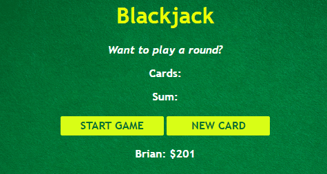

# Blackjack

The object is to get a hand with a value as close to 21 as possible without going over.

**Link to project:**

## How's it made

**Tech used:** HTML, CSS, JavaScript

## What I learnt

Most of these were a good refresher for:

- arrays
- objects
- booleans
- if else statements
- comparison operators
- logical operators
- for loops
- The Math object
- return statements
